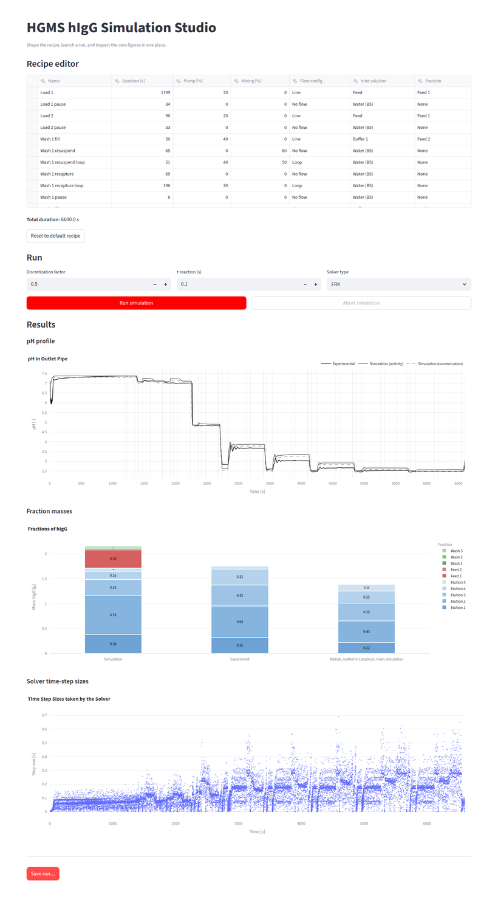
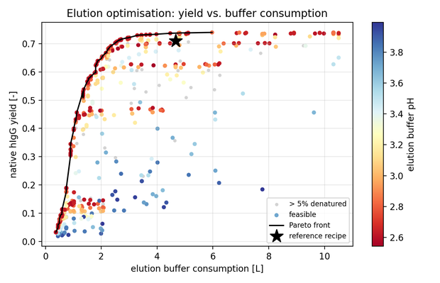

# HGMS-hIgG-separation

**Created by Frank Zillmann during his Bachelor's Thesis: High-Performance Process Simulations for Magnetic Separation of Biomolecules**

## Overview

Simulates a multi-step separation process for human Immunglobulin G purification using magnetic nanoparticles (MNPs) and Rotor-Stator High Gradient Magnetic Separation. The simulation includes:

- Convection and dispersion in many unit operations (pipes, chamber, volumes)
- Magnetic capture and slurry formation in rotor-stator process chamber
- Multi-stage loading, washing, and elution operations
- Chemical reactions (buffer systems, pH calculations)
- Langmuir adsorption kinetics of hIgG on MNPs

The same model can be run from C++ or from Python (via the FS³ Python bindings), explored
interactively in a browser app, or used as the objective of a process optimisation.



## Setup

```bash
# Clone with FS3 framework submodule
git clone --recursive https://github.com/frank-zillmann/HGMS-hIgG-separation.git
cd HGMS-hIgG-separation

# C++ flow: build + install FS³ as a C++ library, then this project against it
./external/FS3/scripts/build.sh    # -> external/FS3/install
./scripts/build.sh                 # -> install/bin (add -DCMAKE_BUILD_TYPE=Debug for ASan)
./scripts/recompile.sh             # quick rebuild after code changes

# Python flows: the fs3 extension module, then the plotting / UI / optimisation packages
pip install ./external/FS3         # builds the FS3's python bindings into site-packages (see FS³ README for wheel/conda variants)
pip install -r requirements.txt
```

## Running

**1. C++ simulation** — the original flow. Writes `run_<timestamp>/{obs,logs,bench}/` into the
working directory; the grid search writes `hyperparameter_search_results_<timestamp>.npz`. The
plotting scripts in `python/` read those files.

```bash
./install/bin/HGMS_hIgG_separation_main_run
./install/bin/HGMS_hIgG_separation_hyperparameter_grid_search   # sweep tau / discretization
```

**2. Python simulation** — identical model and results through the FS³ bindings, with the process
defined in readable modules (`components.py`, `reactions.py`, `unit_operations.py`, `recipe.py`).
Writes `data/runs/run_<timestamp>/` with the observations (`obs/`) and the pH, fraction and
time-step figures (`plots/`).

```bash
python python/run.py
```

**3. Simulation Studio (UI)** — edit the recipe in a table, start a run, follow pH and solver step
sizes live (screenshot above). *Save run…* writes the observations to `data/ui_runs/<name>/obs/`.

```bash
streamlit run python/ui.py
```

**4. Elution optimisation** — searches elution buffer pH, number of elution cycles and three step
durations with NSGA-II (Optuna) for the best trade-off between native hIgG yield and elution
buffer consumption, with at most 5 % acid-denatured hIgG in the pooled eluate. Writes every trial
to `data/optimization/trials.csv` plus the two figures (`pareto_front.png`, `pH_sensitivity.png`).

```bash
python python/optimize.py
```



## VS Code

Press **`Ctrl + Shift + B`** for the build tasks, or **Run Task** for the four flows above.
`Debug HGMS_hIgG_separation` (F5) attaches gdb to the C++ run.

## Built with FS³
This project uses [FS³ - Fast and Flexible Framework for Simple Simulations of Separation-Processes](https://github.com/frank-zillmann/FS3). See its README for setup and build instructions.
